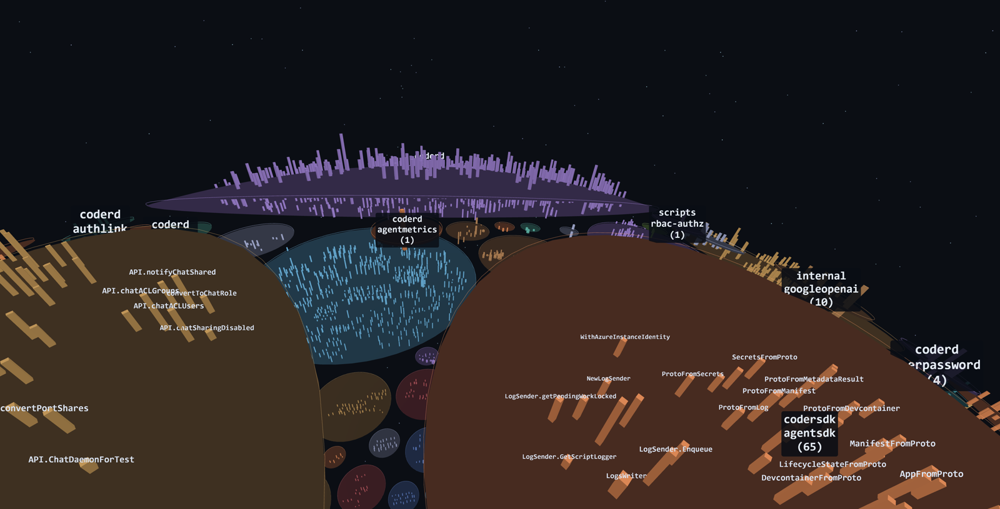
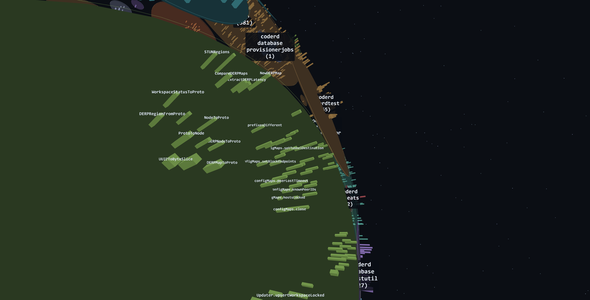
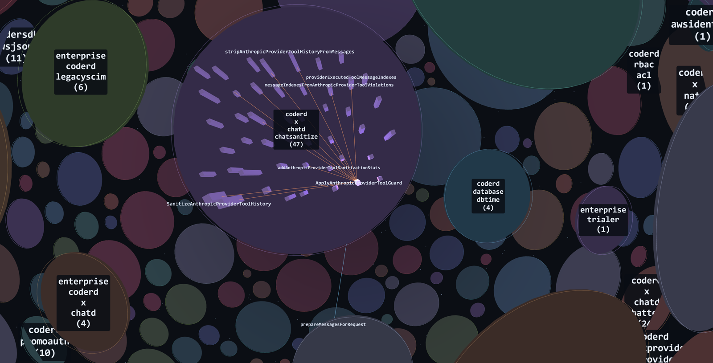

# callscape

A Go module's call graph, as districts you fly through.



Every package is a district — a patch of one sphere, packed by accretion so the crust
fills up rather than radiating out from a middle. Every symbol is a building that
straddles the ground, sized by how many packages call it and as tall as the function is
long. Above is [coder](https://github.com/coder/coder): 7,941 symbols across 321
districts, generated code filtered out.

```sh
make dev                                # dev server; open the printed URL
make dump TARGET=/path/to/a/go/module   # writes web/public/graph.json
go run ./cmd/callscape-dump --stats /path/to/a/go/module   # same data, as text
```

`make dev` on a fresh clone flies this repo, which is a small town. Point `make dump` at
something the size of the screenshots above to get a city.

Or install the dumper on its own:

```sh
go install github.com/dpritchett/callscape/cmd/callscape-dump@latest
```

Then edit `web/public/view.json` while the page is open: what's on screen changes within
a second, without a reload and without moving the camera. That loop is the point of the
project.

**Controls:** click to capture the mouse, WASD to fly, Q/E down and up, shift to burn
(it drops back a half second after you stop), `F` to fly to whatever is selected, `C` to
look behind you, `/` to search for a symbol, tab to swap the panel, escape to release.
On a gamepad the right stick is a control column — pull back to climb, left and right to
roll — and the triggers are the rudder.

## Fly to a symbol, and read it



Names appear as you get near enough for them to mean something, and a symbol's own label
sits at whichever end of its building faces you.



Selecting a symbol lights its neighbourhood: callers in blue, callees in orange, the rest
of the city dimmed to the districts it touches. The selection itself breathes and casts
light, so you can tell it is behind you without turning round. Wires inside a district arc
over the ground rather than cutting under it, and cross-district calls still tunnel
straight through the sphere.

Tab swaps the panel between what the graph knows about the selection, the function's own
source (coloured by `go/scanner`, not a guess), and a list of whatever district you are
pointing at.

## What it does

`cmd/callscape-dump` loads a module with `go/packages` and emits one node per top-level func
or method declared in that module, plus an edge for every statically resolved call
between them. `web/` lays each package out as a disc on a sphere — deterministic
positions, so two runs are comparable — and encodes `size`, `color` and `height` from
whichever node fields `view.json` names.

Requires Go 1.26+ (per `go.mod`). Node is pinned in `.mise.toml`.

## view.json

The whole control surface. Unknown fields are an error rather than ignored.

```jsonc
{
  "occupants": {
    "packages": ["*"],        // globs over package paths; * spans slashes
    "minFanIn": 1,
    "limit": 0,               // top N by encoding.size; 0 means all
    "generated": "exclude"    // include | exclude | only
  },
  "encoding": {
    "size": "fanInPkgs",      // any node field
    "color": "pkg",
    "height": "lines",
    "scale": "log"            // linear | sqrt | log
  },
  "edges": {
    "show": "auto",           // auto | all | cross | selected | none
    "opacity": 0.7
  },
  "camera": { "focus": "pkg/path.Symbol", "distance": 120 },
  "select": []                // symbols to light up on load
}
```

Node fields: `id name pkg file line lines exported generated fanIn fanOut
fanInPkgs fanOutPkgs`.

**`fanIn` counts call sites; `fanInPkgs` counts distinct calling packages.** They
disagree sharply on real code — coder's most-called function has 837 call sites
from 2 packages, because a generated file calls it once per wrapper — and
`fanInPkgs` is usually the one you want.

## Known limits

**Calls through an interface resolve to the interface method, not the implementation.**
This is the big one. On [gitlab-kiosk](https://github.com/radiusmethod/gitlab-kiosk) —
244 nodes, 16 packages, the module this was built against — only **4 of 67** drawn edges
cross a package boundary, because its transport chain is interface-based and most of the
inter-package structure resolves into interfaces and disappears. The districts render as
nearly disconnected islands. That number is a measurement, not a bug to route around, but
it does mean the cross-package view is much sparser than the code really is.

**Nothing here is verified in a browser.** The test suite covers the pure half —
`place(graph, view)`, the ranking behind the search and district panels, the movement
model, the label sizing, the token spans. No automated browser has ever loaded the page,
so rendering, controls and the reload loop are verified by looking at them.

The screenshots above were taken by the page itself, on request from a terminal
(`make cue` to aim, `make shot` to capture). That only reaches the canvas: the HUD, the
panels and the search have never appeared in any image this project can take, which is
why their text is unit-tested instead of screenshotted.

**Point it only at code you trust.** `go/packages` shells out to the Go toolchain, so
dumping a module runs `go list` against it — which can fetch dependencies, honour a
`toolchain` directive, and preprocess cgo. That is the same exposure as running any Go
build on that code, and the same reason not to do it to a repo you just cloned from a
stranger.

**The dev server is a dev server.** It binds localhost. Don't `--host` it onto a network
you share.

## Checks

```sh
make check    # go vet, go test, golangci-lint, tsc --noEmit, vitest
make hooks    # install the lefthook pre-commit hooks, once per clone
```

lefthook calls `make` targets, so there is one source of truth per check. There is no CI —
`ARCHITECTURE.md` says why.

## The other documents

`WORKING.md` is the operating manual: the edit loop, the instruments (`make logs`,
`make shot`, `make cue`), the working agreements, and the gotchas already paid for.
`ARCHITECTURE.md` has the ground rules, the seam between the two halves, and the known
limits. `DECISIONS.md` lists every call made under the ten-minute rule with what was
rejected. `HANDOFF.md` is the brief this was built from, unedited. Any of the three tells
you more than this README about why it looks like this.

MIT licensed.
